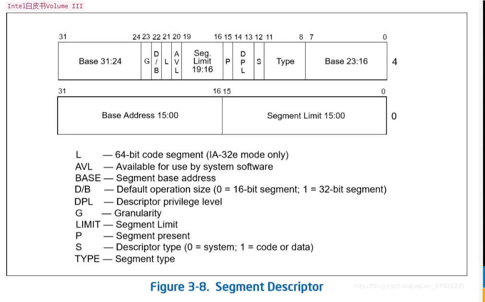

以下面这个描述符为例子
```asm
mov dword [0x08], 0x0000ffff
mov dword [0x0c], 0x00cf9800
```
下图是直接解析的立即数 `0x0000ffff`(下面一行) `0x00cf9800`(上面一行), 不用考虑小端序存内存。

- 0x00cf9800: 0000 0000 1100 1111 1001 1000 0000 0000
- 0x0000ffff: 0000 0000 0000 0000 1111 1111 1111 1111 
- 段限长字段 Limit(Segment limit field): 用于指定段的长度。处理器会把段描述符中两个段限长字段组合成一个 20 位的值, 并根据颗粒度标志 G 来指定段限长 Limit 值的实际含义。
    - 如果 G=0, 则段长度 Limit 范围可从 1B～1MB, 单位是 1B。
    - 如果 G=1, 则段长度 Limit 范围可从 4KB～4GB, 单位是 4KB。

- 描述符类型标志 S(Descriptor type flag): 用于指明一个段描述符是系统段描述符(当 S=0)还是代码或数据段描述符(当 S=1)

- 基地址字段 Base(Base address field): 该字段定义在 4GB 线性地址空间中一个段字节 0 所处的位置。处理器会把 3 个分立的基地址字段组合形成一个 32 位的值。段基地址应该对齐 16 字节边界。16 字节对齐不是必须的, 但对齐在 16 字节边界上使得程序能最大化程序性能。

- 段类型字段 TYPE(Type field): 指定段或门的类型、说明段的访问类型以及段的扩展方向。该字段的解释依赖于描述符类型标志 S 指明是一个应用(代码或数据)描述符还是一个系统描述符。TYPE 字段的编码对代码、数据或系统描述符都不同。

- 描述符特权级字段 DPL(Descriptor privilege level): 用于指明描述符的特权级。特权级范围从 0 到 3。0 级特权级最高, 3 级最低。DPL 用于控制对段的访问。

- 段存在标志 P(Segment present): 用于指出一个段是在内存中(P=1)还是不在内存中(P=0)。当一个段描述符的P标志为 0 时, 那么把指向这个段描述符的选择符加载进段寄存器将导致产生一个段不存在异常。

- D/B 标志(默认操作大小/默认栈指针大小和/或上界限, Default operation size/default stack pointer size and/or upper bound): 根据段描述符描述的是一个可执行代码段、下扩数据段还是一个堆栈段, 这个标志具有不同的功能。(对于32位代码和数据段, 这个标志应该总是设置为1; 对于 16 位代码和数据段, 这个标志被设置为 0。)
    - 可执行代码段。此时这个标志称为 D 标志并用于指出该段中的指令引用有效地址和操作数的默认长度。如果该标志置位, 则默认值是 32 位地址和 32 位或 8 位的操作数; 如果该标志为 0, 则默认值是 16 位地址和 16 位或 8 位的操作数。指令前缀 0x66 可以用来选择非默认值的操作数大小; 前缀 0x67 可用来选择非默认值的地址大小。
    - 栈段(由SS寄存器指向的数据段)。此时该标志称为 B(Big) 标志, 用于指明隐含堆栈操作(如PUSH、POP或CALL)时的栈指针大小。如果该标志置位, 则使用 32 位栈指针并存放在 ESP 寄存器中; 如果该标志为 0, 则使用 16 位栈指针并存放在 SP 寄存器中。如果堆栈段被设置成一个下扩数据段, 这个 B 标志也同时指定了堆栈段的上界限。
    - 下扩数据段。此时该标志称为 B 标志, 用于指明堆栈段的上界限。如果设置了该标志, 则堆栈段的上界限是 0xFFFFFFFF(4GB); 如果没有设置该标志, 则堆栈段的上界限是 0xFFFF(64KB)。

- 64 位代码段标志 L(64-bits code segment): 在 IA-32 模式, 第二个双字的第 21 字节指示一个代码的是否包含本地 64 位代码。L 置 1 表示这个代码段的指令执行在 64 位模式, 置 0 表示执行在兼容模式。如果 L 位被设置了, 那么 D 标志一定要置 0。当不处于 IA-32e 模式时, 和对于非代码段, 这个位被保留并且总是应该被置 0。
